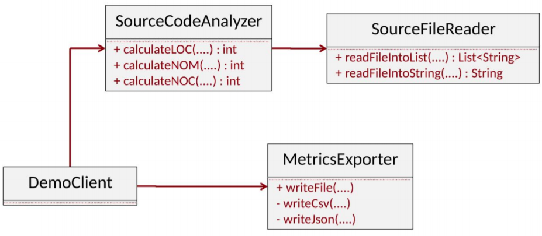
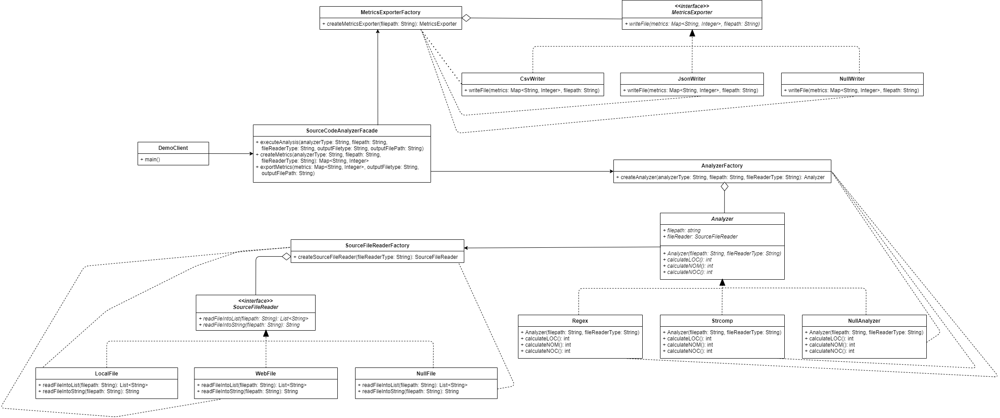

# Source Code Analyzer - Design Patterns

This assignment concerns the redesign of a poorly designed system. The system reads a Java source code file that is stored locally or on the web, calculates the Lines of Code (LOC), Number of Classes (NOC) and Number of Methods (NOM) metrics, and finally, exports these metrics to an output file. The system's refactoring is based on the SOLID design principles by applying the appropriate design patterns.

## Initial System

Here you can see the initial class diagram of the system:

### System Problems
This System is considered problematic, has a lot of smells and violates some of the SOLID design principles.

#### Implementation smells
- Long methods
- Complex methods

#### Design smells
- Missing Abstraction
- Missing Hierarchy
- Insufficient Modularization

#### Architecture smells
- God components
- Feature Concetration

#### SOLID Design Principles Violations
- **Open-Closed Principle** : The extension of the software entities is difficult.
- **Interface Segregation Principle** : There is just one general-purpose client interface, including a lot of functionalities.
- **Dependency Inversion Principle** : There is no Abstraction, thus higher-level modules depend on lower-level modules.

Concluding the system does not have the demanded  Low Coupling - High Complexity design.

## Refactored System

The refactored system is created considering all the smells of the initial system and applies some design patterns to fix the previously mentioned problems.

Here you can see the class diagram of the refactored system:

### Design Patterns Used
- **Facade**
- **Factory**
- **Strategy**
- **Bridge**
- **Null Object**

